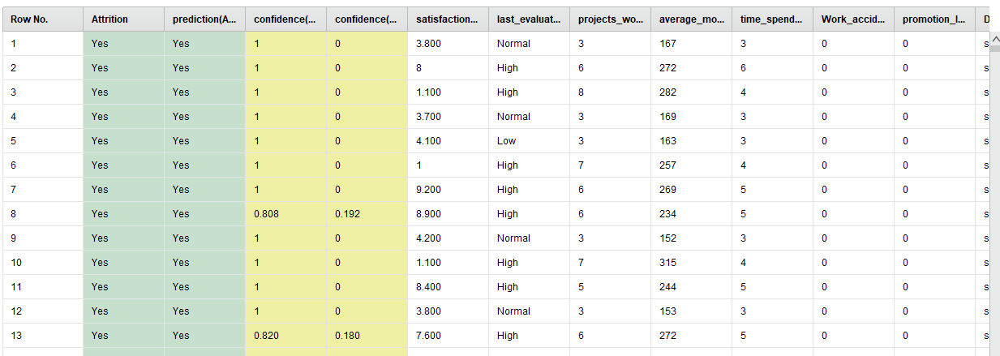

# Tugas Associate Data Scientist
Nama : Masdarul Rizqi 
Kelas : ADS-B
## Soal
Kami merupakan perusahaan yang ingin menganalisis data kinerja karyawan kami. Kami ingin mendapatkan insight dari data data yang telah kami terima, data tersebut meliputi seperti satisfaction_level, last_evaluation_ratin, projects_worked_on, average_montly_hours, time_spend_company, Work_accident, promotion_last_5years, Department, salary, Attrition. 

Dataset karyawan perusahaan tersebut dapat anda unduh disini 
https://drive.google.com/drive/folders/1ViyLNs-B6n17bSmCGUcMbiQ8T5VBEQkI?usp=sharing

Pertanyaan
1.  Apakah insight yang bisa saya dapatkan dari contoh data di atas ?
2.  Bagaimana Langkah yang anda lakukan dalam melakukan telaah data, serta tuliskan tahapan anda dalam melakukan pembersihan data, sebelum data dapat anda olah ?
3.  Bangunlah model klasifikasi dari data di atas untuk membentuk data tersebut menjadi pekerja dengan kategori kinerja baik, sedang dan rendah.
    1.  tentukan atribut yang akan anda gunakan ? 
    2.  Berikan alasan anda mengapa memilih atribut tersebut ?
4.  Buatlah model klasifikasi dari data tersebut untuk melihat karyawan yang akan bertahan di perusahaan atau tidak, dalam folder terdapat data train dan data test.
5.  Apa kesimpulan yang dapat anda berikan kepada perusahaan mengenai data yang peruahaan tersebut miliki, berikan saran anda mengenai data data yang seharusnya di lengkapi atau di analisis lebih lanjut oleh perusahaan 
## Jawaban 
### 1. Apakah insight yang bisa saya dapatkan dari contoh data di atas ?
Mengecek data kolom untuk dataset Test.csv, terdapat kolom : 
 
Gambar 1,  menunjukkan struktur kolumnya.  
Kolom | Keterangan | Data Type
--- |  --- | ---
ID | Merepresentasikan Id unik | Integer
satisfaction_level | Merepresentasikan Tingkat Kepuasan | Real
last_evaluation_rating | Merepresentasikan Evaluasi kinerja karyawan | Real
projects_worked_on  | Merepresentasikan Proyek yang dikerjakan | Integer
average_montly_hours | Merepresentasikan  Jumlah jam kerja rata - rata dalam sebulan | Interger
time_spend_company | Merepresentasikan  Waktu yang telah dihabiskan pada perusahaan | Integer
Work_accident | Merepresentasikan  Adanya Kejadian Kerja | Integer
promotion_last_5years | Merepresentasikan  Promosi terakhir dilakukan selama 5 tahun | Integer 
Department | Merepresentasikan  Departemen tempat bekerja | Polynominal 
salary | Merepresentasikan  Gaji Karyawan | Polynominal
Attrition | Merepresentasikan   Attrition (Berarti meninggalkan pekerjaan)| Integer

Tabel 1, Attribut pada test Dataset

---------
Mengecek data kolom untuk dataset Train.csv, terdapat kolom: 
 
Gambar 2, menunjukkan struktur kolumnya.  

Kolom | Keterangan | Data Type
--- |  --- | ---
satisfaction_level | Merepresentasikan Tingkat Kepuasan | Real
last_evaluation_rating | Merepresentasikan Evaluasi kinerja karyawan | Real
projects_worked_on  | Merepresentasikan Proyek yang dikerjakan | Integer
average_montly_hours | Merepresentasikan  Jumlah jam kerja rata - rata dalam sebulan | Interger
time_spend_company | Merepresentasikan  Waktu yang telah dihabiskan pada perusahaan | Integer
Work_accident | Merepresentasikan  Adanya Kejadian Kerja | Integer
promotion_last_5years | Merepresentasikan  Promosi terakhir dilakukan selama 5 tahun | Integer 
Department | Merepresentasikan  Departemen tempat bekerja | Polynominal 
salary | Merepresentasikan  Gaji Karyawan | Polynominal
Attrition | Merepresentasikan   Attrition (Berarti meninggalkan pekerjaan)| Integer

Tabel 2, Attribut pada Train Dataset
### 2. Bagaimana Langkah yang anda lakukan dalam melakukan telaah data, serta tuliskan tahapan anda dalam melakukan pembersihan data, sebelum data dapat anda olah ?
1. Mengecek data Null/Mising Terlebih dahulu pada dataset menggunakan  `Train.isnull().sum()`, `Test.isnull().sum()` dan  tidak ada data Missing pada dataset in 
 
Gambar 3, menunjukkan total null atau Mising pada test maupun train  
2.  Mengecek Data Duplikat Terlebih dahulu pada  dataset Training dan Testing dengan cara `train.duplicated().sum()`, `test.duplicated().sum()`. Hasilnya, untuk dataset test, tidak ditemukan duplikat, sedangkan untuk dataset train terdapat 4530 duplikat.
3.  Menghapus duplikat menggunakan cara `train.drop_duplicates(inplace=True)`, lalu kita simpan csv nya dengan nama Train_data.csv menggunakan cara `train.to_csv("train_data.csv", index=False)`
### 3. Bangunlah model klasifikasi dari data di atas untuk membentuk data tersebut menjadi pekerja dengan kategori kinerja baik, sedang dan rendah.
1. Dengan menggunakan Read CSV, dataset Test dan dataset Train akan dimuat dengan mengambil semua atribut. Label akan ditetapkan menggunakan kategori evaluasi kinerja terakhir (last_evaluation_rating), yang dipilih berdasarkan tingkat kualitas kerja karyawan yang terbagi menjadi baik, sedang, dan rendah. Secara khusus, pada dataset Test, kolom Id akan digunakan sebagai identifikasi. 
 
Gambar 4, Memberi atribut pada data 
2. Menggunakan Generate Attribute untuk last_evaluation_category. Atribut ini akan mengambil nilai dari kolom last_evaluation_rating dan mengubahnya menjadi kategori berdasarkan aturan berikut: jika nilai kurang dari 5, kategori adalah kinerja rendah; jika nilai kurang dari 7, kategori adalah kinerja sedang; jika nilai lebih dari atau sama dengan 7, kategori adalah kinerja baik.  
 
Gambar 5,  Mengubah nomor ke angka
3.  Menggunakan klasifikasi K-NN untuk melakukan prediksi terhadap sekumpulan data berdasarkan pembelajaran dari data yang sudah terklasifikasi sebelumnya. 
 
Gambar 6, Hasil K-NN 
4.  Untuk menyatukan semua operator dari Read CSV, Generate Attribute, K-NN, dan menambahkan Apply Model.  
 
gambar 7, Process 
5.  Run akan menghasilkan Data  
 
Gambar 8, Hasil Data
### 4. Buatlah model klasifikasi dari data tersebut untuk melihat karyawan yang akan bertahan di perusahaan atau tidak, dalam folder terdapat data train dan data test.
1. Dengan menggunakan Read CSV, semua kolom akan digunakan sebagai atribut, namun satu kolom akan digunakan untuk ID, dan satu kolom lainnya akan digunakan untuk label. Kolom tersebut adalah Attrition, yang menunjukkan apakah karyawan bertahan di perusahaan atau tidak, dan terdapat dalam data train dan data test.  
 
Gambar 9, Memberi atribut pada data 
2.  Dengan menggunakan Generate Attribute, angka 0 dan 1 akan diubah menjadi huruf. Angka 1 akan diartikan sebagai meninggalkan perusahaan atau pekerjaan, sedangkan angka 0 akan diartikan sebagai tidak meninggalkan perusahaan atau pekerjaan. 
 
Gambar 10,  Mengubah nomor ke angka
3.   Menggunakan klasifikasi K-NN untuk melakukan prediksi terhadap sekumpulan data berdasarkan pembelajaran dari data yang sudah terklasifikasi sebelumnya.
 
Gambar 11, Hasil K-NN 
4. Untuk menyatukan semua operator dari Read CSV, Generate Attribute, K-NN, dan menambahkan Apply Model. 
 
Gambar 12, Process 
5.  Run akan menghasilkan Data  
 
Gambar 13, Hasil Data
### 5. Apa kesimpulan yang dapat anda berikan kepada perusahaan mengenai data yang peruahaan tersebut miliki, berikan saran anda mengenai data data yang seharusnya di lengkapi atau di analisis lebih lanjut oleh perusahaan 
Berdasarkan telaah data yang telah dilakukan, berikut adalah kesimpulan dan saran yang dapat diberikan kepada perusahaan:

1.  Tingkat Kepuasan dan Evaluasi Kinerja:

    *   Tingkat kepuasan dan evaluasi kinerja karyawan dapat memberikan wawasan penting tentang kondisi karyawan di perusahaan.
    *   Perusahaan dapat memperhatikan hubungan antara tingkat kepuasan, evaluasi kinerja, dan faktor-faktor lain seperti jumlah jam kerja, kecelakaan kerja, promosi, dan departemen tempat bekerja untuk memahami faktor-faktor yang mempengaruhi kinerja karyawan.
2.  Attrition:

    *   Attrition (tingkat pergantian karyawan) adalah aspek kritis yang perlu diperhatikan oleh perusahaan.
    *   Melalui analisis data, perusahaan dapat mengidentifikasi pola dan tren terkait dengan karyawan yang cenderung meninggalkan perusahaan.
    *   Perusahaan dapat menggunakan informasi ini untuk mengembangkan strategi retensi karyawan yang lebih efektif.
3.  Saran untuk Pengumpulan Data Tambahan atau Analisis Lebih Lanjut:

    *   Perusahaan dapat mempertimbangkan untuk mengumpulkan data tambahan seperti umur, pendidikan, pengalaman kerja, dan faktor-faktor lain yang dapat memengaruhi kinerja dan retensi karyawan.
    *   Analisis lebih lanjut tentang hubungan antara variabel-variabel ini dan kinerja/retensi karyawan dapat memberikan wawasan lebih mendalam dan memungkinkan perusahaan untuk mengambil tindakan yang lebih terarah dalam pengelolaan sumber daya manusia.
4.  Pembersihan Data dan Pemrosesan Lanjutan:

    *   Penting untuk melakukan pembersihan data secara menyeluruh, termasuk mengatasi duplikat dan memeriksa integritas data.
    *   Pemrosesan lanjutan seperti normalisasi atau pengkodean variabel kategori juga dapat meningkatkan kualitas analisis dan model yang dihasilkan.

Dengan memperhatikan kesimpulan dan saran di atas, perusahaan dapat lebih memahami dinamika internal organisasi mereka dan mengambil langkah-langkah yang lebih efektif dalam manajemen sumber daya manusia dan strategi bisnis mereka.